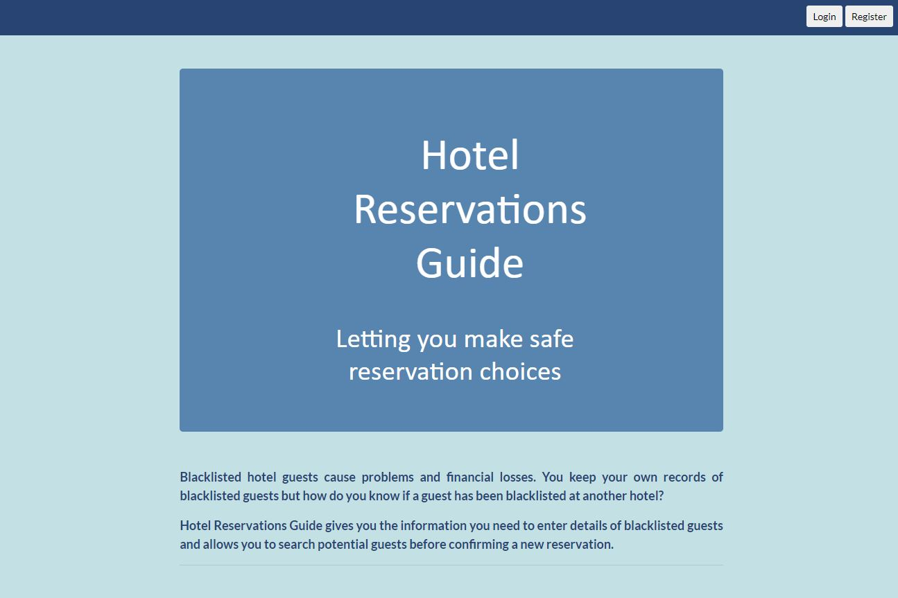
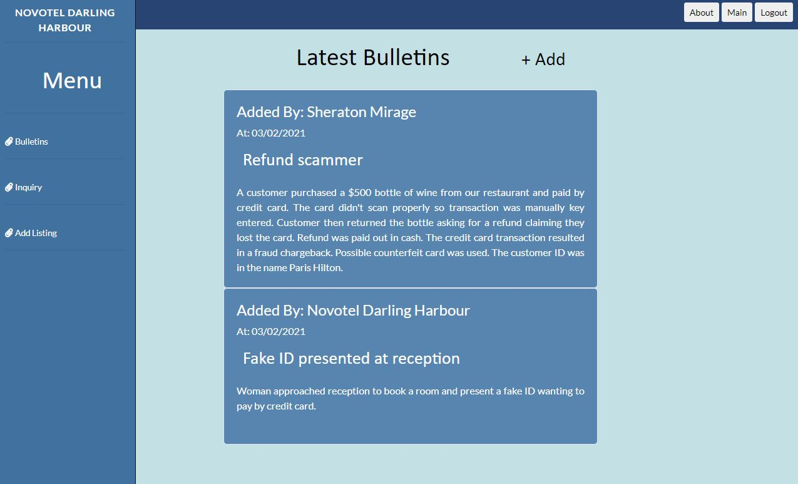
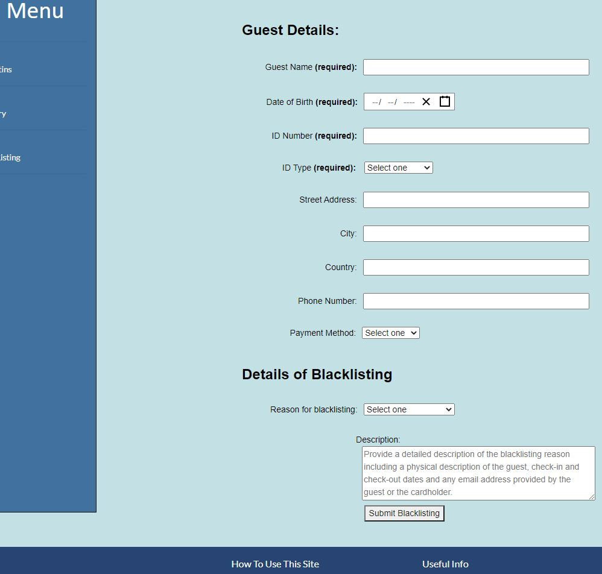
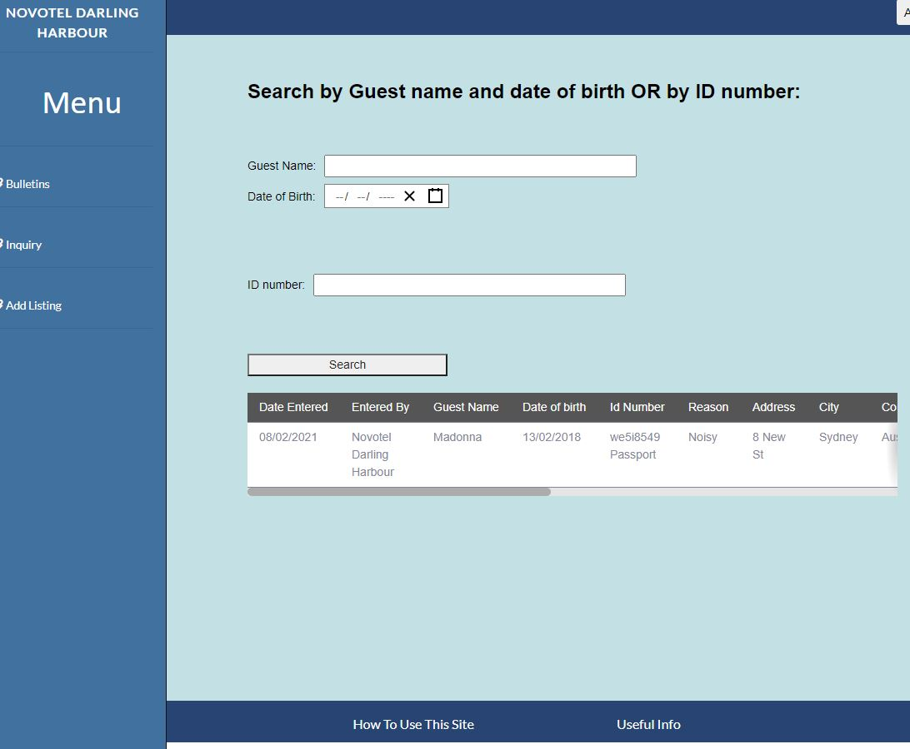

# Reservations Guide

This is an app to be used by hotels only. Hotels sometimes received guest which do damage or commit fraud causing a financial loss to the hotel and the hotel blacklists the guests. Different hotel chains do not communicate with each other so the guest can visit another hotel and do the same thing.
This app can be used by hotels to add blacklisted guest details and they may also do a search to check if potential guests are blacklisted by other hotels.

The link to the deployed site is here: https://glacial-woodland-70883.herokuapp.com/

New technologies used:

<ul>
  <li>react-router-hash-link to allow scroll to top of page when clicking links</li>
  <li>react-date-picker for the datepicker</li>
<ul>

Sample Data

User logins:

Novotel Darling Harbour
UserID: novotel@accounts.com
Password: password123

Sheraton Mirage
UserID: sheraton@sheraton.com
Password: hotel123

Travelodge Sydney
UserID: travelodge@accounts.com
Password: password

Sample Data to search with:

Guest name: Bev Hatzl
Guest date of birth: 01 Feb 1980
guest ID number: A12345
cardholder ID number: 12345678

Guest name: Joe Smith
Guest date of birth: 21 May 1997
guest ID number: A987654
cardholder ID number: 987654

Guest name: Jeremy Willis
Guest date of birth: 20 August 1997
Guest ID number: B123123

# Table of Contents
* [Instructions](#instructions)
* [Built With](#built-with)
* [Screenshots](#screenshots)
* [Future Development](#future-development)
* [Author](#author)

## Instructions

Just run the app with npm start and login with one of the sample login userIDs listed above. Complete instructions are in the How To Use section of the app located in the footer. The sign-up page has been replaced with a Contact section for potential new users to request a login.

## Built With

* [VScode] (https://code.visualstudio.com/) 
* [Create React App] (https://github.com/facebook/create-react-app)
* [mongoDB] (https://www.mongodb.com/)
* [mongoosejs] (https://mongoosejs.com/)
* [Express] (https://expressjs.com/)

## Screenshots

## Future Development

Future versions will enable the results to be clicked on with a popup displaying the description.

## Author
Beverley Hatzl 2021
